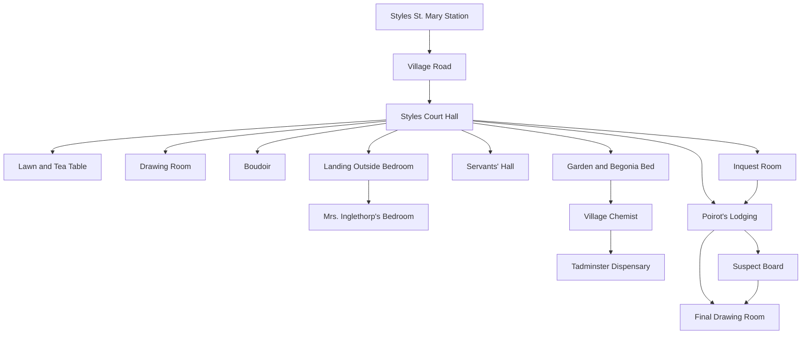
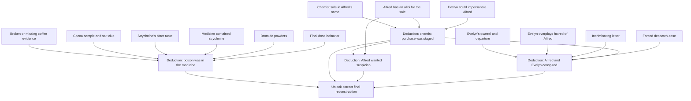

# Styles Court Case Board

Design document for adapting Agatha Christie's *The Mysterious Affair at
Styles* into Dunge as an authored, choice-based detective game.

Status: design only. No Dunge implementation code is included here.

Spoiler level: full solution. This document assumes the author needs the whole
case structure, including the murderer, method, and final reveal.

Source note: The source text used for this adaptation is Project Gutenberg
eBook 863, *The Mysterious Affair at Styles* by Agatha Christie:
https://www.gutenberg.org/ebooks/863. Project Gutenberg lists the work as
"Public domain in the USA." If this adaptation is distributed outside the
United States, confirm local copyright status first.

## Adaptation Goal

The goal is not to reproduce the novel chapter by chapter. The goal is to turn
the case into a playable investigation that stresses Dunge's authored story
features:

- Room exploration.
- Once-only discoveries.
- Conditional descriptions.
- Evidence flags.
- Interview choices unlocked by clues.
- Red herrings.
- Multi-step deductions.
- Phase gates.
- Multiple endings based on what the player has actually established.

The player is Captain Hastings. Poirot acts as a mentor, hint system, and final
judge of the player's theory. This keeps the player close to the original
viewpoint while allowing the game to ask the player to notice, connect, and
accuse.

## Adaptation Principles

1. Do not force the player to guess invisible parser verbs.
   Every meaningful action should be a choice surfaced by the current room,
   person, or evidence board.

2. Separate facts from deductions.
   A player can find the medicine bottle, the bromide powders, and the chemist
   testimony without automatically understanding the murder method. The
   deduction should be its own gated choice.

3. Make false theories playable.
   John, Alfred, Lawrence, Mary, Cynthia, and Dr. Bauerstein should all have
   enough suspicious evidence to tempt the player.

4. Let Poirot help without solving too early.
   Poirot can ask questions, summarize missing categories, and unlock
   deduction scenes. The best ending requires the player to assemble the case.

5. Keep the solution fair.
   Every necessary step in the final reconstruction must be supported by
   discoverable clues and at least one optional reinforcement clue.

6. Use acts to control information flow.
   The player should not be able to solve the whole case before the murder
   happens, before the inquest, or before key false leads have developed.

7. Never create a silent unwinnable state.
   Act transitions may change rank, tone, available witnesses, and how a clue
   is discovered, but they must not permanently remove any clue required for a
   successful ending unless an equivalent recovery route remains available.

## Solvability Contract

The case must always remain solvable unless the player explicitly chooses a
final accusation, abandons the investigation, or selects another clearly marked
ending route. The player should never be wandering a doomed investigation
without knowing it.

Core rule:

- Required deductions must depend on recoverable evidence.
- Optional clues may be missable.
- Core clues may be delayed, reframed, or discovered through testimony instead
  of first-hand observation, but they must not disappear permanently.
- A missed first-hand clue can reduce the final rank, change Poirot's tone, or
  remove a more elegant deduction path. It must not block the correct ending.

Recommended evidence tiers:

| Tier | May Be Missed Permanently? | Effect |
|---|---|---|
| Core clue | No | Required for a major deduction or ending |
| Redundant clue | Yes, if another route proves the same point | Reinforces a deduction |
| Flavor clue | Yes | Adds characterization, mood, or suspicion |
| Rank clue | Yes | Improves final evaluation but is not required |
| Trap clue | No, if needed to escape a false theory | Prevents unfair wrong accusation |

Act transition rule:

Before advancing an act, the game should check whether every future core
deduction still has at least one available evidence route. If a first-hand route
is closing, the transition should open a replacement route through testimony,
Poirot, police notes, servant recollection, inquest statements, or a later room
state.

Examples:

- If the player does not notice the hot-weather fire before the murder, Dorcas
  can mention it later.
- If the player does not inspect the cocoa immediately, Annie or the inquest can
  establish the tray details later.
- If the player misses early hints about Cynthia's dispensary work, the inquest
  can surface it formally.
- If the player fails to hear a quarrel first-hand, Dorcas, Mary, or later
  testimony can provide weaker but sufficient versions of the fact.
- If the player misses Emily's fear before her death, the charred will, the
  despatch-case, and Poirot's questions can still reconstruct it.

The only irreversible choices should be explicit:

- "Make a final public accusation."
- "Leave Styles and abandon the investigation."
- "Ask Poirot to solve the case for you."

These choices should communicate that they are committing the player to an
ending or lower rank.

## High-Level Structure

| Phase | Role | Main Player Activity | Ends When |
|---|---|---|---|
| Prologue | Arrival at Styles | Meet household, learn tensions, establish suspects | Player retires for the night |
| Act I | The Day Before | Explore household conflicts, observe routine, collect pre-murder facts | Dinner and bedtime sequence completes |
| Act II | The Night of the Tragedy | Respond to locked-room crisis, discover first physical clues | Poirot agrees to investigate |
| Act III | The Investigation | Search rooms, question household, build suspect tracks | Enough core evidence unlocks the inquest |
| Act IV | Inquest and False Solutions | Hear testimony, test accusations, deepen red herrings | Player builds at least two major deductions |
| Act V | The Last Link | Find the hidden connection between clues and culprit | Final reconstruction unlocks |
| Epilogue | Reveal and Outcome | Accuse, reconstruct, or fail | Ending selected |

## Act Details

### Prologue: Arrival at Styles

Purpose:

- Introduce Hastings as the player character.
- Establish Styles Court as the hub.
- Introduce the household and their tensions.
- Teach the loop: enter room, inspect, ask, return.

Available rooms:

- Styles St. Mary Station.
- Village Road.
- Styles Court Hall.
- Lawn and Tea Table.
- Drawing Room.

Required discoveries:

- `fact-hastings-on-leave`
- `fact-john-invited-hastings`
- `fact-emily-married-alfred`
- `fact-household-dislikes-alfred`

Optional discoveries:

- `clue-evie-warning`
- `clue-cynthia-dispensary`
- `clue-mary-poison-talk`
- `clue-emily-controls-money`

Gate to Act I:

- Player has met Emily, Alfred, John, Mary, Cynthia, and Evelyn.
- Player chooses "Settle in for the evening."

Design note:

The prologue should feel relaxed but loaded. Almost every casual conversation
becomes useful later.

Solvability note:

No prologue clue is required only in its prologue form. If the player misses a
household introduction detail, later dialogue or testimony must recover the
same mechanical fact.

### Act I: The Day Before

Purpose:

- Let the player observe household routines before the murder.
- Seed the will, coffee, cocoa, medicine, and quarrel threads.
- Establish which facts are ordinary and which become suspicious after death.

Available rooms:

- Styles Court Hall.
- Drawing Room.
- Boudoir.
- Lawn and Tea Table.
- Garden.
- Servants' Hall.

Required discoveries:

- `fact-emily-drinks-coffee-after-dinner`
- `fact-emily-takes-night-medicine`
- `fact-emily-keeps-papers-in-purple-case`
- `fact-evie-leaves-after-quarrel`

Optional discoveries:

- `clue-quarrel-overheard`
- `clue-fire-in-hot-weather`
- `clue-gardeners-near-begonias`
- `clue-emily-worried-after-letter`
- `clue-john-money-pressure`
- `clue-mary-jealous`
- `clue-lawrence-medical-training`

Gate to Act II:

- Player chooses "Go to bed."
- If the player missed too much, the game can still continue. Missed prologue
  facts should be recoverable later through testimony, but at weaker confidence.

Design note:

This act should not feel like "collect all clues before the murder." It is a
social map. Later, the player realizes that several ordinary observations were
evidence.

Solvability note:

The player may miss first-hand observations in this act, but the act transition
must preserve fallback routes. Missing these clues should affect rank or
deduction elegance, not block the solution.

### Act II: The Night of the Tragedy

Purpose:

- Create the central locked-room crisis.
- Give the player first contact with physical evidence.
- Move the game from social drama to investigation.

Available rooms:

- Landing Outside Emily's Room.
- Mrs. Inglethorp's Bedroom.
- Cynthia's Room.
- Styles Court Hall.
- Poirot's Lodging.

Required discoveries:

- `event-emily-dies`
- `clue-locked-bedroom`
- `clue-broken-bell`
- `clue-broken-coffee-cup`
- `clue-cocoa-saucepan`
- `clue-purple-despatch-case`

Optional discoveries:

- `clue-stain-on-floor`
- `clue-green-fabric`
- `clue-cynthia-deep-sleep`
- `clue-alfred-absent-at-crisis`
- `clue-lawrence-natural-death-theory`

Gate to Act III:

- Player has inspected Emily's bedroom.
- Player has either summoned Poirot or chosen to ask John for permission to
  bring Poirot in.

Design note:

The room should initially overwhelm the player with possibilities. Deductions
are intentionally not available yet. This creates a useful Dunge test: many
flags get set, but their meaning is deferred.

Solvability note:

Bedroom evidence can be discovered in multiple passes. If police activity or
phase changes alter the room, the changed description should expose any
remaining core clue through a new route rather than removing it.

### Act III: The Investigation

Purpose:

- Convert rooms into repeatable evidence locations.
- Open interview tracks.
- Let the player start forming suspect pressure.

Available rooms:

- Styles Court Hall.
- Mrs. Inglethorp's Bedroom.
- Boudoir.
- Servants' Hall.
- Garden and Begonia Bed.
- Village Chemist.
- Poirot's Lodging.
- Suspect Board.

Required discoveries:

- `clue-charred-will-fragment`
- `clue-dorcas-heard-quarrel`
- `clue-gardeners-witnessed-will`
- `clue-dispensary-access`
- `clue-chemist-strychnine-sale`

Optional discoveries:

- `clue-despatch-key-lost`
- `clue-despatch-case-forced`
- `clue-missing-coffee-cup`
- `clue-cocoa-not-poisoned`
- `clue-alfred-withholds-alibi`
- `clue-bauerstein-up-at-night`
- `clue-mary-overheard-more`
- `clue-john-anonymous-note`

Gate to Act IV:

- Player has found at least three physical clues from Emily's bedroom.
- Player has interviewed Dorcas or the gardeners about the will.
- Player has visited Poirot with at least one suspect theory.

Design note:

The suspect board becomes important here. It gives the player a stable place to
review motive, means, opportunity, and contradictions.

Solvability note:

The Act IV gate should check for available routes, not just collected flags. If
the player lacks a required category, Poirot or the suspect board should point
to the relevant room, witness, or formal testimony before the transition.

### Act IV: Inquest and False Solutions

Purpose:

- Give formal testimony.
- Make John and Alfred look strongly suspicious.
- Give the player enough information to make wrong but plausible accusations.
- Open chemistry/medicine deductions.

Available rooms:

- Inquest Room.
- Styles Court Hall.
- Poirot's Lodging.
- Suspect Board.
- Village Chemist.
- Tadminster Dispensary.

Required discoveries:

- `testimony-death-by-strychnine`
- `testimony-emily-new-will`
- `testimony-lawrence-medical-contradiction`
- `testimony-cynthia-dispensary`
- `testimony-alfred-suspicious-purchase`

Optional discoveries:

- `clue-bromide-powders`
- `clue-medicine-contained-strychnine`
- `clue-final-dose-danger`
- `clue-strychnine-bitter`
- `clue-alfred-alibi-too-convenient`
- `clue-john-inherits`
- `clue-mary-shields-john`

Gate to Act V:

- Player has made at least two deductions, correct or incorrect.
- Correct path requires `deduction-poison-in-medicine` and either
  `deduction-chemist-purchase-staged` or `deduction-alfred-wanted-arrest`.

Design note:

Act IV should be the danger zone. The player can "solve" the case badly here.
This is where Dunge can test wrong endings, soft failures, and Poirot hinting.

Solvability note:

Wrong theories in Act IV should be reversible unless the player explicitly
makes a public accusation. Private theories presented to Poirot are feedback
opportunities, not hidden failure states.

### Act V: The Last Link

Purpose:

- Shift suspicion away from obvious suspects.
- Reveal that the staged evidence is the point.
- Connect Alfred and Evelyn.

Available rooms:

- Poirot's Lodging.
- Styles Court Hall.
- Emily's Bedroom.
- Boudoir.
- Suspect Board.
- Final Drawing Room.

Required discoveries:

- `clue-incriminating-letter`
- `clue-evelyn-staged-quarrel`
- `clue-evelyn-could-impersonate-alfred`
- `clue-alfred-and-evelyn-linked`

Optional discoveries:

- `clue-evelyn-medical-knowledge`
- `clue-evelyn-overplays-hatred`
- `clue-alfred-forces-despatch-case`
- `clue-emily-found-letter`
- `clue-emily-burned-will`

Gate to Epilogue:

- Correct route:
  - `deduction-poison-in-medicine`
  - `deduction-chemist-purchase-staged`
  - `deduction-alfred-wanted-arrest`
  - `deduction-alfred-evelyn-conspiracy`
- Partial route:
  - Any two correct major deductions.
- Failure route:
  - Player makes a final accusation without a valid method and culprit theory.

Design note:

The "last link" is not a new room. It is a new interpretation of old evidence.
This is a good place to use Poirot's lodging and the suspect board heavily.

Solvability note:

The final act should not open merely because time has passed. It opens when the
case is either solvable by the player or intentionally ready for a partial
Poirot-led ending.

### Epilogue: Reveal and Outcome

Purpose:

- Let the player present the case.
- Reward complete reasoning.
- Preserve Poirot's canonical reveal when the player is missing pieces.

Endings:

1. Player-led solution.
   The player identifies Alfred Inglethorp and Evelyn Howard, explains the
   medicine method, explains the staged chemist purchase, and explains why
   Alfred wanted suspicion to fall on him.

2. Poirot-led solution.
   The player has enough evidence to bring the case to Poirot but misses one
   major deduction. Poirot explains the missing link. This is a success, but
   lower rank.

3. Wrong accusation.
   The player accuses John, Lawrence, Mary, Cynthia, or Dr. Bauerstein without
   a complete theory. Poirot stops them, or the case collapses at inquest/trial.

4. Alfred trap ending.
   The player pushes too hard to arrest Alfred before understanding the staged
   evidence. Alfred's legal position becomes harder to attack. Poirot can still
   salvage the case only if the player later finds the conspiracy evidence.

5. Unresolved case.
   The player leaves Styles or exhausts formal options with too few discoveries.
   Poirot solves it off-screen, or the culprit escapes, depending on tone.

## Scene Graph

This graph shows location flow, not every conditional choice.

## Evidence Dependency Graph

The game should be authored from this graph outward. Rooms and interviews feed
facts into the graph; deductions and endings read from it.

## State Categories

These are not implementation code. They are authoring names for the case board.

### Phase Flags

| Flag | Meaning |
|---|---|
| `phase-prologue-complete` | Household introduction complete |
| `phase-murder-happened` | Emily has died |
| `phase-poirot-engaged` | Poirot is investigating |
| `phase-inquest-open` | Inquest scene can be entered |
| `phase-inquest-complete` | Formal testimony has been heard |
| `phase-final-open` | Final reconstruction is available |

### Fact and Location Flags

Fact flags are stable setup facts rather than suspicious evidence. Location
flags mark places the player has learned how to reach.

| Flag | Meaning |
|---|---|
| `fact-hastings-on-leave` | Hastings is at Styles while recovering from war service |
| `fact-john-invited-hastings` | John brought Hastings to Styles |
| `fact-emily-married-alfred` | Emily recently married Alfred |
| `fact-household-dislikes-alfred` | The household resents or distrusts Alfred |
| `fact-emily-drinks-coffee-after-dinner` | Emily normally has coffee after dinner |
| `fact-emily-takes-night-medicine` | Emily takes medicine at night |
| `fact-emily-keeps-papers-in-purple-case` | Emily keeps important papers in the purple despatch-case |
| `fact-evie-leaves-after-quarrel` | Evelyn leaves Styles after a public quarrel |
| `location-chemist-known` | The village chemist can be visited |
| `location-poirot-known` | Poirot's lodging can be visited |

### Evidence Flags

Evidence flags represent things the player has directly observed, heard, or
collected.

| Flag | Discovery |
|---|---|
| `clue-evie-warning` | Evelyn warns that Alfred is dangerous |
| `clue-cynthia-dispensary` | Cynthia works around medicines and poisons |
| `clue-dispensary-access` | The player has enough context to visit or question the dispensary |
| `clue-mary-poison-talk` | Mary mentions poison as a real danger |
| `clue-emily-controls-money` | Emily's money dominates the household |
| `clue-quarrel-overheard` | A violent quarrel is overheard before death |
| `clue-dorcas-heard-quarrel` | Dorcas can describe what she heard of the quarrel |
| `clue-fire-in-hot-weather` | Emily ordered a fire on an unusually hot day |
| `clue-gardeners-near-begonias` | The gardeners were working where they could be summoned |
| `clue-gardeners-witnessed-will` | Gardeners witnessed a new will |
| `clue-emily-worried-after-letter` | Emily seemed frightened after reading something |
| `clue-charred-will-fragment` | A burnt fragment suggests a destroyed will |
| `clue-emily-found-letter` | Emily found a dangerous letter |
| `clue-emily-burned-will` | Emily likely burned her own will |
| `clue-purple-despatch-case` | Emily kept important papers in a purple case |
| `clue-despatch-key-lost` | The original key to the case went missing |
| `clue-despatch-case-forced` | The case was later forced open |
| `clue-stain-on-floor` | A stain in the bedroom suggests overlooked movement or damage |
| `clue-broken-bell` | Emily's bell could not summon help |
| `clue-broken-coffee-cup` | Coffee evidence is damaged or missing |
| `clue-cocoa-saucepan` | Cocoa was present but may be misleading |
| `clue-cocoa-not-poisoned` | Cocoa does not explain the poisoning |
| `clue-missing-coffee-cup` | A cup has vanished from the expected set |
| `clue-cynthia-deep-sleep` | Cynthia slept through sounds she should have heard |
| `clue-green-fabric` | A scrap suggests someone moved where they deny going |
| `clue-alfred-absent-at-crisis` | Alfred's absence during the crisis looks suspicious |
| `clue-medicine-contained-strychnine` | Emily's medicine already contained strychnine |
| `clue-bromide-powders` | Bromide powders can alter the medicine |
| `clue-final-dose-danger` | The last dose could become disproportionately lethal |
| `clue-strychnine-bitter` | Strychnine would be hard to hide in some drinks |
| `clue-chemist-strychnine-sale` | Strychnine was bought in Alfred's name |
| `clue-alfred-alibi-sale-time` | Alfred can account for himself at the purchase time |
| `clue-alfred-alibi-too-convenient` | Alfred's alibi is strong in a way that should worry the player |
| `clue-alfred-withholds-alibi` | Alfred refuses to make his innocence easy |
| `clue-alfred-forces-despatch-case` | Alfred risks forcing the despatch-case to recover evidence |
| `clue-evelyn-staged-quarrel` | Evelyn's departure looks useful, not spontaneous |
| `clue-evelyn-overplays-hatred` | Evelyn's hatred of Alfred becomes suspiciously theatrical |
| `clue-evelyn-could-impersonate-alfred` | Evelyn could plausibly disguise herself as Alfred |
| `clue-evelyn-medical-knowledge` | Evelyn has enough practical knowledge or access to understand the medicine route |
| `clue-alfred-and-evelyn-linked` | Alfred and Evelyn have a concealed connection |
| `clue-incriminating-letter` | A letter connects the method and accomplices |
| `clue-john-money-pressure` | John has financial motive |
| `clue-john-inherits` | John appears to benefit from legal arrangements around Emily's estate |
| `clue-john-anonymous-note` | John was lured away by a note |
| `clue-mary-jealous` | Mary's unhappiness gives her a motive to hide information |
| `clue-mary-overheard-more` | Mary heard more of the quarrel than she admits |
| `clue-mary-shields-john` | Mary hides facts to protect John |
| `clue-lawrence-medical-training` | Lawrence knows enough medicine to recognize strychnine |
| `clue-lawrence-natural-death-theory` | Lawrence oddly pushes a natural-death theory |
| `clue-bauerstein-up-at-night` | Bauerstein's nocturnal presence looks suspicious |

### Event and Testimony Flags

Event flags mark story events. Testimony flags mark formal evidence delivered
through the inquest rather than casual exploration.

| Flag | Meaning |
|---|---|
| `event-emily-dies` | The murder has happened |
| `testimony-death-by-strychnine` | Medical testimony identifies strychnine poisoning |
| `testimony-emily-new-will` | Testimony establishes that Emily made a new will |
| `testimony-lawrence-medical-contradiction` | Lawrence's testimony conflicts with his medical background |
| `testimony-cynthia-dispensary` | Cynthia's work creates a poison-access suspicion |
| `testimony-alfred-suspicious-purchase` | Inquest testimony points toward Alfred and strychnine |

### Deduction Flags

Deduction flags represent conclusions the player has explicitly formed.

| Flag | Requires | Meaning |
|---|---|---|
| `deduction-will-burned-by-emily` | Hot-weather fire, charred will, Emily's fear | Emily herself destroyed the will |
| `deduction-quarrel-was-not-alfred` | Dorcas testimony, Mary overheard more, will timing | The key quarrel may have been with John |
| `deduction-cocoa-is-red-herring` | Cocoa sample, bitter strychnine clue, coffee evidence | Cocoa is not the murder vehicle |
| `deduction-poison-in-medicine` | Medicine strychnine, bromide powders, final dose | The regular medicine was made lethal |
| `deduction-chemist-purchase-staged` | Chemist sale, Alfred alibi, disguise possibility | The sale was arranged to mislead |
| `deduction-alfred-wanted-arrest` | Staged sale, withheld alibi, excessive obviousness | Alfred wanted suspicion to fall on him safely |
| `deduction-evelyn-not-straightforward` | Staged quarrel, overplayed hatred, contradictions | Evelyn is not merely an angry friend |
| `deduction-alfred-evelyn-conspiracy` | Evelyn link, staged sale, letter, method | Alfred and Evelyn committed the murder together |
| `deduction-john-red-herring` | Anonymous note, Mary shielding, will confusion | John's suspicious behavior is not murder |
| `deduction-lawrence-red-herring` | Medical contradiction, emotional motive, no method proof | Lawrence is suspicious but not the murderer |
| `deduction-bauerstein-red-herring` | Nighttime presence, spy subplot optional | Bauerstein distracts from the family case |

## Room Catalog

### Styles St. Mary Station

Player-facing description:

The station is small, sunlit, and almost absurdly peaceful. The war feels far
away here. John Cavendish waits beside a motor car, relieved to see Hastings
and eager to fill the quiet with family grievances.

Game role:

- Tutorial scene.
- Establishes Hastings and John.
- Starts the Alfred resentment thread.

Important choices:

| Choice | Gate | Sets |
|---|---|---|
| Ask John about Styles | Always | `fact-john-invited-hastings` |
| Ask about Alfred Inglethorp | Always | `fact-emily-married-alfred`, `fact-household-dislikes-alfred` |
| Ask about Cynthia | After Alfred topic or arrival topic | `clue-cynthia-dispensary` |

### Village Road

Player-facing description:

The road to Styles passes fields, cottages, and wartime quiet. The estate sits
beyond the village like a private world with its own rules.

Game role:

- Connects manor to village.
- Later opens the chemist and Poirot's lodging.

Important choices:

| Choice | Gate | Sets |
|---|---|---|
| Notice the village chemist | Prologue or later | `location-chemist-known` |
| Ask about Belgian refugees nearby | Prologue or later | `location-poirot-known` |

### Styles Court Hall

Player-facing description:

The hall is polished, old, and ruled by habit. Doors lead toward drawing room,
boudoir, servants' passages, and the stairs. After the murder, the same space
feels like a waiting room outside judgment.

Game role:

- Main hub.
- Navigation hub.
- Status hub after phase changes.

Conditional descriptions:

| Condition | Description Change |
|---|---|
| Before murder | Servants pass with trays; family voices drift in from other rooms |
| After murder | People speak in lowered voices; everyone seems to be listening |
| After inquest | The household has split into defensive little camps |
| Final act | Poirot's presence makes the hall feel staged for revelation |

### Lawn and Tea Table

Player-facing description:

Tea is laid under a wide tree. The sunlight flatters everyone and conceals
nothing for long: Evelyn's bluntness, Mary's control, Cynthia's brightness,
Emily's command, and Alfred's theatrical devotion all show themselves here.

Game role:

- Character introduction scene.
- Early social clue scene.

Important choices:

| Choice | Gate | Sets |
|---|---|---|
| Speak with Evelyn Howard | Prologue | `clue-evie-warning` |
| Speak with Mary Cavendish | Prologue | `clue-mary-poison-talk` |
| Speak with Cynthia Murdoch | Prologue | `clue-cynthia-dispensary` |
| Watch Alfred with Emily | Prologue | `fact-household-dislikes-alfred` |

### Drawing Room

Player-facing description:

The drawing room is comfortable in the expensive, impersonal way of a room that
has heard too many family quarrels and politely remembered none of them.

Game role:

- Family conversation scene.
- Later final reveal staging option.
- Good place for Mary and Lawrence interviews.

Important choices:

| Choice | Gate | Sets |
|---|---|---|
| Ask Mary about the household | Prologue or Act I | `clue-mary-jealous` |
| Ask Lawrence about medicine | After murder | `clue-lawrence-medical-training` |
| Gather everyone for Poirot | Final open | Moves to Final Drawing Room |

### Boudoir

Player-facing description:

Emily's boudoir is full of correspondence, charity papers, household accounts,
and the sense of a woman who liked every thread of the house to pass through
her hands.

Game role:

- Will and letter thread.
- Quarrel thread.
- Despatch-case setup.

Important choices:

| Choice | Gate | Sets |
|---|---|---|
| Examine writing desk | Act I or later | `fact-emily-keeps-papers-in-purple-case` |
| Listen at the door | Act I timed event | `clue-quarrel-overheard` |
| Ask Dorcas about the quarrel | After murder | `clue-dorcas-heard-quarrel` |
| Connect quarrel to new will | Charred will plus gardeners | `deduction-will-burned-by-emily` |

### Landing Outside Emily's Room

Player-facing description:

The corridor is cramped with frightened people. Behind the locked door, a
woman's voice and then a terrible silence turn household suspicion into fact.

Game role:

- Night crisis.
- Establishes locked-room pressure.
- Connects to Cynthia's sleep and broken bell.

Important choices:

| Choice | Gate | Sets |
|---|---|---|
| Force the door | Murder event | `event-emily-dies`, `clue-locked-bedroom` |
| Try the bell | Murder event | `clue-broken-bell` |
| Check Cynthia's room | After crisis | `clue-cynthia-deep-sleep` |

### Mrs. Inglethorp's Bedroom

Player-facing description:

The bedroom is disordered by panic: a fallen table, traces of late-night drinks,
the locked purple case, a cold grate with charred paper, and too many people
claiming to have noticed too little.

Game role:

- Main physical evidence room.
- Highest-density clue location.
- Changes after police, Poirot, and final act visits.

Important choices:

| Choice | Gate | Sets |
|---|---|---|
| Inspect the grate | After murder | `clue-charred-will-fragment` |
| Inspect the coffee remains | After murder | `clue-broken-coffee-cup` |
| Inspect the cocoa | After murder | `clue-cocoa-saucepan` |
| Inspect the medicine | After murder, later enhanced by inquest | `clue-medicine-contained-strychnine` |
| Inspect the purple case | After murder | `clue-purple-despatch-case` |
| Notice the forced lock | After case is reopened/Act III | `clue-despatch-case-forced` |
| Search near the door/window | After murder | `clue-green-fabric` |

### Servants' Hall

Player-facing description:

The servants' hall has its own map of Styles: who rang, who quarrelled, who
carried trays, who went upstairs, and who was too proud or frightened to say
what they saw.

Game role:

- Testimony hub.
- Dorcas and Annie interviews.
- Turns household events into evidence.

Important choices:

| Choice | Gate | Sets |
|---|---|---|
| Ask Dorcas about the quarrel | After murder | `clue-dorcas-heard-quarrel` |
| Ask about Emily's fire | After murder | `clue-fire-in-hot-weather` |
| Ask about coffee/cocoa tray | After murder | `clue-missing-coffee-cup` or `clue-cocoa-saucepan` |
| Ask about the despatch-case key | After purple case clue | `clue-despatch-key-lost` |

### Garden and Begonia Bed

Player-facing description:

The formal beds look freshly worked. The gardeners remember times, errands,
and signatures better than anyone upstairs expects them to.

Game role:

- Will timing.
- Witnesses.
- Outdoor red herring routes.

Important choices:

| Choice | Gate | Sets |
|---|---|---|
| Inspect the begonia bed | Act III | `clue-gardeners-near-begonias` |
| Question Manning | After charred will | `clue-gardeners-witnessed-will` |
| Reconstruct will timing | Gardeners plus fire plus will fragment | `deduction-will-burned-by-emily` |

### Village Chemist

Player-facing description:

The chemist's shop is narrow, glassy, and precise. Every bottle has a label.
Every poison has a rule. The register is less silent than the person who signed
it intended.

Game role:

- Strychnine purchase.
- Alfred trap.
- Disguise thread.

Important choices:

| Choice | Gate | Sets |
|---|---|---|
| Ask about strychnine | After inquest or Poirot prompt | `clue-chemist-strychnine-sale` |
| Check the time of purchase | Chemist sale known | `clue-alfred-alibi-sale-time` |
| Study the purchaser description | Chemist sale known | `clue-evelyn-could-impersonate-alfred` |
| Compare signature/handwriting | Chemist sale plus John note | `deduction-chemist-purchase-staged` |

### Tadminster Dispensary

Player-facing description:

The dispensary is orderly but dangerous, a place where ordinary hands measure
extraordinary substances. Cynthia knows this world. So, perhaps, did someone
else.

Game role:

- Medicine and bromide explanation.
- Cynthia suspicion.
- Chemistry fair-play clue.

Important choices:

| Choice | Gate | Sets |
|---|---|---|
| Ask Cynthia about bromides | Cynthia trust or inquest complete | `clue-bromide-powders` |
| Ask how strychnine tastes | Medicine clue or inquest complete | `clue-strychnine-bitter` |
| Ask whether medicine can change over time | Bromide plus medicine | `clue-final-dose-danger` |
| Conclude medicine method | Medicine, bromide, final dose | `deduction-poison-in-medicine` |

### Poirot's Lodging

Player-facing description:

Poirot's room is small, exact, and impossibly neat. He seems to know more than
he says, but he refuses to give the player an answer that has not been earned.

Game role:

- Hint hub.
- Deduction hub.
- Phase gate hub.
- Safe place to review evidence.

Important choices:

| Choice | Gate | Sets |
|---|---|---|
| Ask what matters now | Always after Poirot engaged | Gives category hint |
| Present a suspect theory | Any suspect pressure | Opens suspect board response |
| Present medicine theory | Required clues | `deduction-poison-in-medicine` |
| Present staged purchase theory | Required clues | `deduction-chemist-purchase-staged` |
| Ask why Alfred hides his alibi | Staged purchase or Alfred alibi | `deduction-alfred-wanted-arrest` |
| Present Evelyn connection | Required clues | `deduction-alfred-evelyn-conspiracy` |

### Suspect Board

Player-facing description:

The board is not a room in the fiction so much as Hastings' notebook spread
across a table: names, motives, means, opportunities, contradictions, and
questions that become sharper as the case darkens.

Game role:

- Evidence review.
- Deduction UI.
- Prevents player from losing track of flags.

Board sections:

- Alfred Inglethorp.
- Evelyn Howard.
- John Cavendish.
- Mary Cavendish.
- Lawrence Cavendish.
- Cynthia Murdoch.
- Dr. Bauerstein.
- Unknown method.

Design note:

This should be available from Poirot's lodging and possibly from the hall. It
can be implemented later as a normal Dunge room.

### Inquest Room

Player-facing description:

The inquest strips the household of drawing-room manners. Timelines harden into
testimony, guesses become public suspicion, and the medical facts finally enter
the case.

Game role:

- Formal evidence dump.
- Opens medicine and legal threads.
- Creates wrong-solution pressure.

Important choices:

| Choice | Gate | Sets |
|---|---|---|
| Listen to medical testimony | Inquest open | `testimony-death-by-strychnine` |
| Focus on Lawrence | Inquest open | `testimony-lawrence-medical-contradiction` |
| Focus on will testimony | Inquest open | `testimony-emily-new-will` |
| Focus on Alfred evidence | Inquest open | `testimony-alfred-suspicious-purchase` |
| Focus on Cynthia | Inquest open | `testimony-cynthia-dispensary` |

### Final Drawing Room

Player-facing description:

Poirot arranges the room like a stage. Every chair matters. Every silence is
placed. The facts have not changed, but for the first time they all point in
one direction.

Game role:

- Final accusation.
- Reconstruction.
- Ending selection.

Important choices:

| Choice | Gate | Outcome |
|---|---|---|
| Accuse Alfred alone | Alfred suspicion high, partnership missing | Wrong or partial ending |
| Accuse John | John pressure high | Wrong accusation |
| Accuse Lawrence | Lawrence pressure high | Wrong accusation |
| Accuse Evelyn and Alfred | Correct major deductions | Player-led solution |
| Ask Poirot to explain | Partial deductions | Poirot-led solution |

## People Catalog

### Captain Arthur Hastings

Role:

- Player character.
- Wounded soldier on leave.
- Amateur detective viewpoint.

Player-facing description:

Hastings wants to be methodical but is vulnerable to charm, indignation, and
romantic assumptions. This makes him a useful player avatar: observant enough
to collect evidence, imperfect enough to make wrong theories plausible.

Gameplay function:

- Can inspect and question.
- Can form deductions on the suspect board.
- Can bring theories to Poirot.

### Hercule Poirot

Role:

- Detective mentor.
- Hint system.
- Gatekeeper for final reconstruction.

Player-facing description:

Poirot is precise, courteous, and maddeningly unwilling to explain himself too
soon. He values order, method, and the exact placement of small facts.

Gameplay function:

- Gives escalating hints.
- Converts clue clusters into deduction choices.
- Blocks unfair or premature final accusations.
- Provides Poirot-led ending if player is close but incomplete.

### Emily Inglethorp

Role:

- Victim.
- Household authority.
- Source of motive for nearly everyone.

Player-facing description:

Emily is generous, autocratic, busy, and used to command. Her money supports
the household, and her recent marriage to Alfred has turned gratitude into
resentment.

Gameplay function:

- Appears in prologue and Act I.
- Her habits create clue paths: coffee, cocoa, medicine, papers, will, fire.
- Her death changes all room descriptions and unlocks investigation.

### Alfred Inglethorp

Role:

- Obvious suspect.
- Actual murderer, with Evelyn.

Player-facing description:

Alfred is younger than Emily, theatrical in dress and manner, and disliked by
almost everyone. Everything about him invites suspicion, which is exactly why
his suspiciousness must be questioned.

Gameplay function:

- Red herring until the player understands the trap.
- True culprit only when paired with Evelyn and the medicine method.
- His withheld alibi is a major deduction gate.

### Evelyn Howard

Role:

- Emily's companion.
- Apparent enemy of Alfred.
- Actual murderer, with Alfred.

Player-facing description:

Evelyn is blunt, loyal-seeming, physically forceful, and morally certain. Her
hatred of Alfred looks like honesty until it begins to look like performance.

Gameplay function:

- Early warning source.
- Hidden culprit route.
- Disguise and staged-quarrel route.
- Final "last link" suspect.

### John Cavendish

Role:

- Host.
- Financially pressured stepson.
- Major red herring.

Player-facing description:

John is decent but weak, worried about money, and tangled in secrets that make
him look guiltier than he is.

Gameplay function:

- Strong wrong accusation path.
- Anonymous note and Mary shielding create suspicion.
- Helps teach the difference between motive and proof.

### Mary Cavendish

Role:

- John's wife.
- Emotionally guarded witness.
- Red herring through concealment.

Player-facing description:

Mary is self-controlled, intelligent, and unhappy. She hides what she overheard
because it touches her marriage, not because she murdered Emily.

Gameplay function:

- Unlocks John red herring.
- Can reveal quarrel timing or withhold it depending on trust.
- Gives a social-interview test for Dunge.

### Lawrence Cavendish

Role:

- John's brother.
- Former medical student.
- Nervous red herring.

Player-facing description:

Lawrence is fragile, evasive, and more medically informed than he first appears.
His denial of poisoning is suspicious because he should know better.

Gameplay function:

- Medical contradiction path.
- False suspect pressure.
- Can help unlock chemistry questions if handled carefully.

### Cynthia Murdoch

Role:

- Emily's protege.
- Dispensary worker.
- Innocent suspect.

Player-facing description:

Cynthia is young, vivid, and dependent on Emily's goodwill. Her work around
drugs makes her suspicious after the poisoning, especially when she sleeps
through the crisis.

Gameplay function:

- Opens dispensary and bromide facts.
- Red herring through access to poison.
- Trust interview can reveal medicine mechanics.

### Dorcas

Role:

- Senior servant.
- Key witness to household routine.

Player-facing description:

Dorcas knows the house through service: trays, keys, fires, bells, errands,
and the tone of voices behind closed doors.

Gameplay function:

- Quarrel testimony.
- Fire clue.
- Coffee/cocoa tray clue.
- Despatch-case key clue.

### Annie

Role:

- Servant witness.
- Tray and cocoa clue source.

Player-facing description:

Annie is nervous but observant. She remembers small domestic details because
they were her responsibility.

Gameplay function:

- Cocoa and tray evidence.
- Missing cup reinforcement.
- Can unlock cocoa red herring deduction.

### Manning and William Earl

Role:

- Gardeners.
- Witnesses to the new will.

Player-facing description:

The gardeners are cautious around the family but precise about practical
matters: time, errands, windows, signatures.

Gameplay function:

- Prove Emily made a new will.
- Tie will timing to the hot-weather fire.

### Dr. Wilkins

Role:

- Local doctor.
- Medical testimony source.

Player-facing description:

Dr. Wilkins is conventional, professional, and initially resistant to the
strangeness of the case.

Gameplay function:

- Establishes death by strychnine.
- Opens formal inquest path.

### Dr. Bauerstein

Role:

- Outside medical expert.
- Suspicious outsider.
- Red herring.

Player-facing description:

Bauerstein is clever, foreign, and awake at odd hours. The household finds him
interesting, which is almost as damaging as finding him suspicious.

Gameplay function:

- Red herring path.
- Optional spy-subplot flavor.
- Reinforces that suspicious behavior is not proof.

### Albert Mace

Role:

- Chemist's assistant.
- Strychnine sale witness.

Player-facing description:

Mace is proud of procedure and frightened of implication. His register creates
one of the most dangerous false leads in the case.

Gameplay function:

- Establishes sale in Alfred's name.
- Provides purchaser description.
- Opens staged-sale deduction.

### Mr. Wells

Role:

- Solicitor.
- Will/legal testimony source.

Player-facing description:

Wells speaks in legal certainties that make the household's private chaos
public and consequential.

Gameplay function:

- Explains old will/new will issue.
- Helps turn charred paper into legal evidence.

### Inspector Japp

Role:

- Police pressure.
- Formal investigation presence.

Player-facing description:

Japp brings procedure, urgency, and the possibility that a plausible but wrong
case will harden before the truth is ready.

Gameplay function:

- Raises stakes in Act IV.
- Can trigger Alfred trap ending if player pushes wrong pressure.

## Evidence Catalog

### Early Social Evidence

| Evidence | Found Through | Unlocks | Design Use |
|---|---|---|---|
| Alfred is disliked | John, tea table | Alfred suspect pressure | Obvious suspect setup |
| Evelyn warns against Alfred | Evelyn interview | Evelyn trust/hatred track | Later becomes suspicious performance |
| Cynthia works in dispensary | John/Cynthia | Dispensary access | Means red herring and medicine path |
| Mary speaks of poisons | Tea table | Mary intelligence, poison motif | Early fair-play clue |
| Emily controls money | John/Emily | Motive for John, Lawrence, Alfred | Motive graph |

### Bedroom Evidence

| Evidence | Found Through | Unlocks | Design Use |
|---|---|---|---|
| Locked bedroom | Night crisis | Murder event confidence | Urgency, locked-room feel |
| Broken bell | Landing/bedroom | Planned helplessness | Suggests preparation |
| Broken coffee cup | Bedroom | Coffee/cocoa debate | False vehicle route |
| Cocoa saucepan | Bedroom | Cocoa red herring | Lets player test wrong method |
| Purple despatch-case | Bedroom | Will/letter path | Document mystery |
| Forced lock | Later bedroom search | Hidden letter path | Alfred's risky retrieval |
| Charred will fragment | Grate | Will deduction | Legal motive confusion |
| Green fabric | Bedroom search | Movement contradiction | Optional reinforcement |
| Medicine bottle | Bedroom/inquest | Medicine method | Core method clue |

### Testimony Evidence

| Evidence | Found Through | Unlocks | Design Use |
|---|---|---|---|
| Dorcas heard quarrel | Servants' Hall | Quarrel timing | Redirects from Alfred |
| Gardeners witnessed will | Garden | New will fact | Proves document existed |
| Lawrence denies poisoning | Inquest | Lawrence suspicion | False suspect |
| Cynthia slept through crisis | Night/inquest | Cynthia suspicion | Drugged-sleep clue |
| Alfred purchase testimony | Chemist/inquest | Alfred pressure | Staged-sale route |
| Alfred alibi | Chemist/Poirot | Alfred trap | Shows sale was staged |

### Chemistry Evidence

| Evidence | Found Through | Unlocks | Design Use |
|---|---|---|---|
| Medicine already contains strychnine | Inquest/doctor | Method cluster | Core fair-play fact |
| Bromide powders | Dispensary/Cynthia | Method cluster | Explains precipitation |
| Final dose is dangerous | Poirot/dispensary | `deduction-poison-in-medicine` | Converts facts to method |
| Strychnine tastes bitter | Doctor/dispensary | Cocoa red herring | Helps rule out drink theories |

### Letter and Conspiracy Evidence

| Evidence | Found Through | Unlocks | Design Use |
|---|---|---|---|
| Emily was frightened after reading something | Act I/Dorcas | Hidden letter theory | Motive for fire and solicitor |
| Incriminating letter exists | Final act/Poirot | Conspiracy deduction | Last link |
| Evelyn's quarrel was staged | Timeline review | Evelyn suspicion | True culprit route |
| Evelyn could impersonate Alfred | Chemist description | Staged sale | Explains false purchase |
| Alfred wanted arrest | Withheld alibi plus staged sale | Final theory | Explains odd behavior |

## Suspect Tracks

### Alfred Track

Suspicious evidence:

- Married Emily for money.
- Disliked by household.
- Connected to strychnine purchase.
- Absent or evasive at key moments.
- Withholds his alibi.

Correct interpretation:

- Alfred is guilty, but not in the simple way the evidence suggests.
- The obvious evidence is partly staged so accusation becomes a shield.
- He must be tied to Evelyn and the medicine method before final accusation.

Wrong ending:

- Accusing Alfred alone too early triggers the Alfred trap ending.

### Evelyn Track

Suspicious evidence:

- Stages a quarrel and leaves the house.
- Performs hatred of Alfred too consistently.
- Has physical/personality traits that make disguise plausible.
- Is linked to Alfred more closely than she admits.
- The staged purchase points toward someone who could imitate him.

Correct interpretation:

- Evelyn is Alfred's accomplice.
- Her hatred is camouflage.
- Her absence is part of the alibi design.

Wrong route risk:

- Players may trust her too long because she is emotionally forceful and seems
  loyal to Emily.

### John Track

Suspicious evidence:

- Needs money.
- Benefits from older legal arrangements.
- Quarrel may involve him.
- Mary hides facts for him.
- Anonymous note manipulates his movements.

Correct interpretation:

- John is compromised but not the murderer.
- He is useful to the culprit as a decoy.

Design use:

- Strong false accusation path.
- Teaches that motive plus secrecy is not enough.

### Mary Track

Suspicious evidence:

- Hides what she overheard.
- Has emotional motive connected to John.
- Appears controlled and unreadable.

Correct interpretation:

- Mary protects her marriage, not a murder plot.

Design use:

- Social trust test.
- Can unlock John red herring resolution.

### Lawrence Track

Suspicious evidence:

- Has medical knowledge.
- Behaves nervously.
- Pushes a natural-death theory he should doubt.

Correct interpretation:

- Lawrence's behavior is suspicious but does not complete means, motive, and
  opportunity.

Design use:

- Medical knowledge red herring.
- Leads player to ask better chemistry questions.

### Cynthia Track

Suspicious evidence:

- Works in dispensary.
- Has access to drugs.
- Sleeps through the crisis.
- Is financially dependent on Emily.

Correct interpretation:

- Cynthia's access is real but the method points elsewhere.
- Her sleep can be explained without making her guilty.

Design use:

- Unlocks bromide/medicine facts.
- Red herring with useful evidence reward.

### Dr. Bauerstein Track

Suspicious evidence:

- Medical expert.
- Up at odd hours.
- Outsider with secrets.

Correct interpretation:

- He is a distraction from the domestic murder plot.

Design use:

- Optional red herring.
- Useful if the adaptation wants more complexity but should not be required.

## Gated Choice Map

This table shows the important non-navigation choices. Smaller movement choices
do not need to be listed here.

| Choice | Appears When | Sets | Notes |
|---|---|---|---|
| Ask Evelyn why she distrusts Alfred | Prologue | `clue-evie-warning` | Later reinterpreted |
| Ask Cynthia about dispensary work | Prologue or Act III | `clue-cynthia-dispensary` | Opens dispensary |
| Listen near the boudoir | Act I timed opportunity | `clue-quarrel-overheard` | Optional early advantage |
| Notice the hot-weather fire | Act I or Act III servant interview | `clue-fire-in-hot-weather` | Will path |
| Force Emily's door | Murder event | `event-emily-dies` | Required crisis |
| Inspect broken bell | After murder | `clue-broken-bell` | Planned crime |
| Inspect coffee/cocoa | After murder | drink clues | Sets false method tracks |
| Inspect medicine bottle | After murder/inquest | `clue-medicine-contained-strychnine` | Full meaning delayed |
| Inspect grate | After murder | `clue-charred-will-fragment` | Will path |
| Question Dorcas | After murder | servant clues | Several branches |
| Question gardeners | Charred will or Poirot prompt | `clue-gardeners-witnessed-will` | Will proof |
| Visit chemist | Inquest or Poirot prompt | sale clues | Alfred track |
| Ask Cynthia about bromides | Cynthia trust or inquest complete | `clue-bromide-powders` | Method path |
| Present cocoa theory to Poirot | Cocoa plus drink clues | May set wrong theory | Poirot can challenge |
| Present medicine theory to Poirot | Medicine plus bromide plus final dose | `deduction-poison-in-medicine` | Major correct deduction |
| Present Alfred-alone theory | Alfred pressure high | Wrong/partial | Can trigger trap warning |
| Ask why Alfred withholds alibi | Alfred alibi known | `deduction-alfred-wanted-arrest` | Major correct deduction |
| Compare chemist description to Evelyn | Sale plus Evelyn clues | `deduction-chemist-purchase-staged` | Major correct deduction |
| Present Evelyn connection | Evelyn staged clues plus letter | `deduction-alfred-evelyn-conspiracy` | Final major deduction |
| Begin final reconstruction | Required major deductions or partial threshold | Final scene | Ending gate |

## Major Deduction Recipes

### Deduction: Cocoa Is a Red Herring

Required:

- `clue-cocoa-saucepan`
- `clue-strychnine-bitter` or `clue-cocoa-not-poisoned`
- Any coffee evidence

Player-facing reasoning:

The room wants the player to stare at drinks. That is useful, but the wrong
drink theory cannot explain enough.

Unlocks:

- Stronger medicine questions.
- Poirot hint about "the thing taken regularly."

### Deduction: Poison Was in the Medicine

Required:

- `clue-medicine-contained-strychnine`
- `clue-bromide-powders`
- `clue-final-dose-danger`

Optional reinforcement:

- `clue-strychnine-bitter`
- `deduction-cocoa-is-red-herring`

Player-facing reasoning:

Emily's ordinary medicine contained strychnine. Bromide can change the mixture
so the last dose becomes lethal. The murderer did not need to poison a cup at
the final moment.

Unlocks:

- Final method branch.
- Removes Cynthia as simple poison-access suspect.
- Makes the timing of earlier preparation important.

### Deduction: The Chemist Purchase Was Staged

Required:

- `clue-chemist-strychnine-sale`
- `clue-alfred-alibi-sale-time`
- `clue-evelyn-could-impersonate-alfred` or handwriting/signature clue

Optional reinforcement:

- `clue-evelyn-staged-quarrel`
- `clue-evelyn-overplays-hatred`

Player-facing reasoning:

The purchase looks too perfect. If Alfred could not have bought the poison, the
purchase was not proof against him. It was a device.

Unlocks:

- Alfred trap deduction.
- Evelyn suspicion.

### Deduction: Alfred Wanted Suspicion

Required:

- `deduction-chemist-purchase-staged`
- `clue-alfred-withholds-alibi`

Optional reinforcement:

- `clue-alfred-alibi-sale-time`

Player-facing reasoning:

An innocent man would use a strong alibi. Alfred hides his because suspicion
helps him if it is built on evidence that can later be broken.

Unlocks:

- Blocks "Alfred alone" final accusation.
- Opens question: who helped create the false evidence?

### Deduction: Alfred and Evelyn Conspired

Required:

- `deduction-chemist-purchase-staged`
- `deduction-alfred-wanted-arrest`
- `clue-evelyn-staged-quarrel`
- `clue-incriminating-letter`

Optional reinforcement:

- `clue-evelyn-overplays-hatred`
- `clue-alfred-and-evelyn-linked`
- `clue-evelyn-could-impersonate-alfred`

Player-facing reasoning:

Evelyn's apparent hatred is protective coloration. Alfred's obvious guilt is a
legal trap. The letter and staged purchase reveal partnership.

Unlocks:

- Correct final reconstruction.

## Final Reconstruction Answer Key

The correct final explanation should require the player to select or confirm
these points in order.

1. Emily was not killed by a freshly poisoned cup of cocoa or coffee.
2. The fatal mechanism involved her regular medicine.
3. Bromide caused the strychnine in the medicine to concentrate in the final
   dose.
4. The public strychnine purchase in Alfred's name was staged.
5. Alfred concealed his alibi because suspicion based on false evidence would
   protect him.
6. Evelyn's quarrel and departure were part of the plot.
7. Evelyn helped create the false evidence and was Alfred's accomplice.
8. The incriminating letter and forced despatch-case explain the desperate
   actions around Emily's papers.
9. Alfred Inglethorp and Evelyn Howard are the culprits.

Incorrect final theories:

| Theory | Why It Fails |
|---|---|
| Alfred alone poisoned a drink | Cannot explain alibi, staged evidence, medicine method |
| John killed for inheritance | Motive exists, but method and staged purchase do not fit |
| Mary killed to protect John | Concealment is emotional/social, not a murder method |
| Lawrence killed with medical knowledge | Suspicious knowledge, no complete plot |
| Cynthia used dispensary poison | Access exists, but she lacks the staged Alfred/Evelyn pattern |
| Bauerstein manipulated the case | Suspicious outsider behavior is not tied to Emily's routine |

## Progression and Scoring

The game can track a simple end rank without exposing numbers:

| Rank | Requirement | Ending Tone |
|---|---|---|
| Brilliant | All major deductions before final scene | Player leads Poirot through the solution |
| Methodical | Correct culprit and method, missing one reinforcement | Poirot fills in minor gaps |
| Assisted | Two major deductions, but culprit incomplete | Poirot solves, player helped materially |
| Misled | Wrong accusation after substantial evidence | Poirot prevents public disaster |
| Failed | Too few clues or premature exit | Case resolves without player success, or culprit escapes |

Suggested major deductions for scoring:

- `deduction-poison-in-medicine`
- `deduction-chemist-purchase-staged`
- `deduction-alfred-wanted-arrest`
- `deduction-alfred-evelyn-conspiracy`
- `deduction-will-burned-by-emily`
- `deduction-john-red-herring`

## Authoring Notes for Dunge

Use rooms for both real places and abstract thinking spaces.

- Real place: "Mrs. Inglethorp's Bedroom."
- Abstract place: "Suspect Board."
- Event place: "Inquest Room."
- Reveal place: "Final Drawing Room."

Keep choices short and concrete:

- "Inspect the grate."
- "Ask Dorcas about the fire."
- "Compare the chemist's description with Evelyn."
- "Tell Poirot the medicine was the vehicle."

Avoid choices that merely restate thoughts without consequence unless they
unlock a deduction, hint, or suspect-board update.

Recommended content pattern:

1. A room describes current state.
2. Visible choices inspect or interview.
3. Once-only choices set clue flags.
4. Conditional choices appear when clue clusters are complete.
5. Deduction choices set deduction flags.
6. Phase gates check deduction flags, not raw clue count alone.

## Minimum Viable Adaptation

If the full case is too large for the first Dunge test, build this slice first:

1. Prologue tea scene with all major suspects.
2. Night murder scene.
3. Emily's bedroom search.
4. Servants' Hall interviews.
5. Poirot's lodging with suspect board.
6. Chemist scene.
7. Dispensary scene.
8. Final reconstruction with three endings:
   - wrong accusation,
   - Poirot-led solution,
   - player-led solution.

This MVP still tests:

- Exploration.
- Once-only clues.
- Conditional interviews.
- Deduction gates.
- Red herrings.
- Multiple endings.

## Open Design Questions

1. Should the player be able to permanently miss clues?
   Recommendation: no for core clues, yes for reinforcement clues.

2. Should wrong accusations end the game immediately?
   Recommendation: early wrong theories should produce Poirot feedback; final
   public accusations should produce endings.

3. Should Poirot's hints be unlimited?
   Recommendation: yes, but hints should reduce final rank if scoring exists.

4. Should the adaptation keep all names and period setting?
   Recommendation: yes. The public-domain setting is part of the charm, and the
   household hierarchy matters to the clue structure.

5. Should Dr. Bauerstein's spy-thread be included?
   Recommendation: optional. It adds complexity but can distract from testing
   the main evidence graph.

6. Should the player ever control Poirot?
   Recommendation: no. Hastings as player keeps uncertainty alive.
